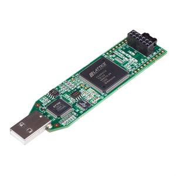

# adventofcode2018
Attempt at solving [Advent of Code 2018](https://adventofcode.com/2018) using Verilog + icestick fpga.



The Lattice icestick is a [cheap](https://www.digikey.com/product-detail/en/lattice-semiconductor-corporation/ICE40HX1K-STICK-EVN/220-2656-ND/4289604) (~$25) FPGA development board with a complete [open source](http://www.clifford.at/icestorm/) toolkit. The board works on Linux, Mac OS X and Windows.

I was initially planning to just use the plain board, but it seems I'm going to need a flash?

## Why?
Why not!
_(also, a good excuse for me to learn some Verilog)_

## Goal
Solve a few day's puzzle using Verilog + icestick FPGA.

## Build
There's a Makefile, with various rules per day. The code gets built inside Docker.

```
git clone https://github.com/alokmenghrajani/adventofcode2018
cd adventofcode2018
make simulate-day01-part1
make simulate-day01-part2
...
```
